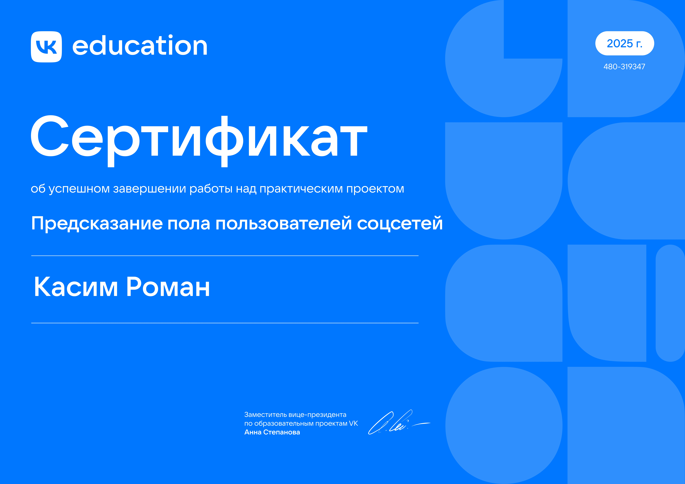

# Предсказание пола пользователей соцсетей

Проект выполнен в рамках образовательной программы [проекты для студентов](https://education.vk.company/education_projects) от VK. 

## О проекте

В рамках кейса решалась задача классификации пола пользователей социальной сети. Данные были предоставлены организаторами программы.

### Основные этапы работы:

**Шаг 1 — данных**

Была проведена обработка предоставленных данных для формирования единого обучающего набора.

**Шаг 2 — Анализ данных**

Был проведен разведывательный анализ данных для понимания структуры, распределений и взаимосвязей признаков.

**Шаг 3 — Разработка и обучение модели**

Была разработана модель *случайного леса с нуля*. Модель была обучена на подготовленных данных. Метрики на тесте: 

<!-- METRICS_START -->

| accuracy | roc_auc | precision | recall | f1 |
| --- | --- | --- | --- | --- |
| 0.81 | 0.81 | 0.80 | 0.80 | 0.80 |

<!-- METRICS_END -->

**Шаг 4 — Инференс**

Было выполнено предсказание пола для новых пользователей.

## Сертификат

